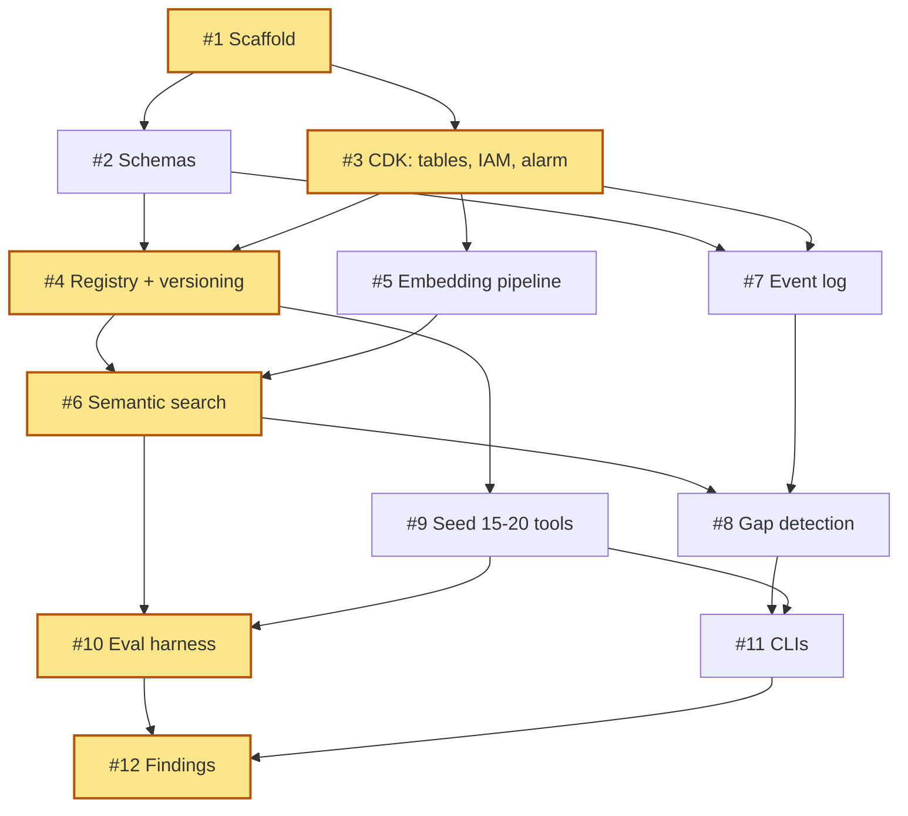
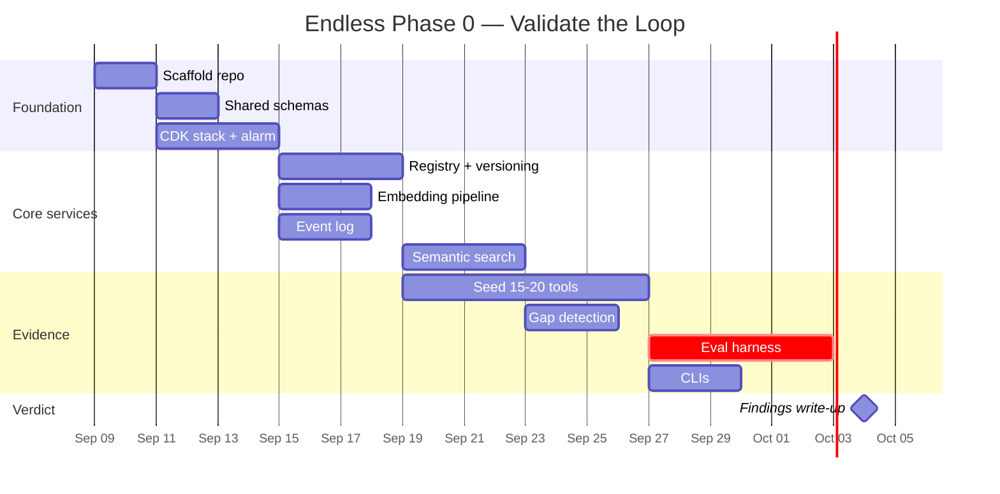

# Project Plan: Endless — Phase 0 (Validate the Loop)

**Generated:** 2026-09-08
**Status:** Draft
**Owner:** @ericsonasamoah3
**Repo:** Endlessandothers/Endlessproject

## Overview

Phase 0 builds the smallest system that can answer one question: **is a logged gap real evidence of an unsolved need, or just a search failure?** Everything in this phase exists to produce that evidence. It is a registry, a semantic search over it, and an append-only gap log — seeded with 15–20 tools wrapping public APIs, run against real queries, with the miss log read by hand.

`PROJECT.md` names gap-signal quality as "genuinely unsolved" and says search quality must be strong *before* gap logging means anything. This plan therefore treats the search-quality evaluation harness (#10) as the centrepiece, not an afterthought.

## Goals

- Register 15–20 real tools with immutable versions and searchable descriptions
- Return a ranked tool for a natural-language query, or log a provenance-tagged gap
- Prove search quality with a labelled eval set **before** trusting any gap
- Emit an event for every search and every call, append-only, from day one
- Run entirely inside AWS always-free limits, with embeddings the only real cost

**Done when:** you can point at logged gaps that are genuinely unsolved needs, not search failures — with recall@3 on the labelled set as the evidence that the distinction holds.

## Stated assumptions

These were not specified in `PROJECT.md` or `CLAUDE.md`. Each is a decision, not a fact — change any of them and the issue list shifts.

| Assumption | Choice | Why |
|---|---|---|
| Language | TypeScript / Node 20 | `CLAUDE.md` defines a tool as "exposed as an MCP server"; the MCP SDK is best supported here, and the same toolchain later serves `/apps/world` and `/apps/console` |
| Compute | Lambda + Function URLs | Always-free (1M req + 400k GB-s/mo). Function URLs avoid API Gateway entirely, which is only free for 12 months |
| Store | DynamoDB | Always-free 25 GB. Holds registry, append-only events, gaps |
| Vector search | Brute-force cosine in Lambda | See "The deliberate non-decision" below |
| Embeddings | Bedrock Titan Text Embeddings V2 | ~$0.02 / 1M tokens; Phase 0 usage is cents. The only non-free component |
| IaC | AWS CDK (TypeScript) | Same language as the services |
| Surface | HTTP API + CLI only | The roadmap says "run real queries, read the miss log by hand". No UI until Phase 1 |
| Execution | **Out of scope** | Phase 0 never executes a registered tool, so `CLAUDE.md` invariant #3 (sandboxing) is not yet triggered. Nothing untrusted runs on our infrastructure in this phase |

### The deliberate non-decision: no vector database

Phase 0 has 15–20 tools. Cosine similarity over 20 vectors held in Lambda memory is sub-millisecond and costs nothing. Standing up OpenSearch or pgvector for 20 rows would burn most of the phase's effort on infrastructure that answers none of the phase's question, and OpenSearch is not always-free.

The search *interface* is defined so the implementation can be swapped later without touching callers. Choosing a vector store is a Phase 1 decision, made with real query data in hand rather than guessed at now.

## AWS free-tier architecture

```
Agent / CLI
    |
    v
Lambda Function URL  (always free: 1M req + 400k GB-s per month)
    |
    +-- registry-fn      tool CRUD, immutable versioning
    +-- search-fn        embed query -> cosine over cached vectors -> rank
    +-- events-fn        append-only writer
    |
    v
DynamoDB  (always free: 25 GB + 25 RCU/25 WCU, PROVISIONED mode only)
    +-- tools       PK tool_id,  SK version        immutable once written
    +-- events      PK event_id, SK ts             append-only, provenance-tagged
    +-- gaps        PK gap_id,   SK ts             append-only, provenance-tagged
    |
    v
Amazon Bedrock — Titan Text Embeddings V2   (the only paid component, ~cents)

S3            tool manifests + embedding snapshots  (5 GB, 12-month tier)
CloudWatch    logs  (5 GB always free)
```

**Cost estimate for the whole phase:** under $2. Embeddings for 20 tool descriptions plus a few thousand queries is well under a million tokens. Everything else sits inside always-free monthly limits.

**Free-tier caveat:** AWS replaced the 12-month free tier on 9 July 2025 with a credit-based Free Plan — $100 (up to $200) of credits over 6 months, and the account closes when they run out. This design leans on *always-free* limits precisely so it survives either account type. Set a **$5 billing alarm** on day one anyway (#3).

## Issues

Twelve issues. Estimates are T-shirt sizes for one developer.

| # | Title | Est. | Depends on |
|---|---|---|---|
| 1 | Scaffold repo with the phantom/visual split | S | — |
| 2 | Define shared schemas: tool, event, gap | S | 1 |
| 3 | CDK stack: DynamoDB tables, Lambda roles, billing alarm | M | 1 |
| 4 | Registry service with immutable versioning | M | 2, 3 |
| 5 | Embedding pipeline on Bedrock Titan V2 | M | 3 |
| 6 | Semantic search endpoint (brute-force cosine) | M | 4, 5 |
| 7 | Append-only event log with provenance | M | 2, 3 |
| 8 | Gap detection and gap log | M | 6, 7 |
| 9 | Seed 15–20 tools wrapping public APIs | L | 4 |
| 10 | **Labelled eval set and recall@k harness** | L | 6, 9 |
| 11 | Query CLI and miss-log review CLI | M | 8, 9 |
| 12 | Phase 0 findings write-up | S | 10, 11 |

### 1. Scaffold repo with the phantom/visual split — S

Create `/services`, `/packages`, `/docs` per `CLAUDE.md`. Only the Phase 0 services exist as directories; the rest stay absent until their phase.

- [ ] `/services/registry`, `/services/search`, `/packages/schemas` exist
- [ ] Root `package.json` workspace, TypeScript strict mode, lint and test scripts
- [ ] `PROJECT.md` moved to `/docs` to match the documented layout
- [ ] `CLAUDE (5).md` renamed to `CLAUDE.md` so its invariants actually load

### 2. Define shared schemas: tool, event, gap — S

The load-bearing artefact of the phase. Every later scoring decision is recomputed from these records, so they must capture enough now.

- [ ] `Tool`: id, version, name, description, MCP endpoint, category, owner, created_at
- [ ] `Event`: id, type (`search` | `call`), ts, actor (agent + session id), payload
- [ ] `Gap`: id, ts, query, top_k results with scores, reason, actor, session
- [ ] Version field is immutable by construction — no update path in the type
- [ ] A `Gap` cannot be constructed without provenance (enforced in the type)

### 3. CDK stack: DynamoDB tables, Lambda roles, billing alarm — M

- [ ] Three tables: `tools`, `events`, `gaps`, **provisioned capacity at 5 RCU / 5 WCU each** (15/15 total, inside the always-free 25/25 — on-demand mode is *not* covered by the free tier)
- [ ] `events` and `gaps` IAM policy grants `PutItem` and `Query` but **not** `UpdateItem` or `DeleteItem` — append-only enforced at the permission layer
- [ ] Least-privilege execution role per function
- [ ] CloudWatch billing alarm at $5
- [ ] `cdk deploy` from a clean clone works and is documented

### 4. Registry service with immutable versioning — M

- [ ] `POST /tools` registers a tool and returns `tool_id@version`
- [ ] Re-registering an existing `tool_id` creates a **new version**; the old row is untouched
- [ ] `GET /tools/{id}` resolves latest; `GET /tools/{id}/{version}` resolves exact
- [ ] A test proves an existing version cannot be mutated (invariant #5)

### 5. Embedding pipeline on Bedrock Titan V2 — M

- [ ] `embed(text) -> number[]` wrapper with retry and token accounting
- [ ] Tool embeddings generated at registration, stored with the tool row
- [ ] Snapshot of all vectors written to S3 for warm-start
- [ ] Token spend logged per call so phase cost is measurable, not guessed

### 6. Semantic search endpoint (brute-force cosine) — M

- [ ] `POST /search {query}` returns top-k with scores, k default 5
- [ ] Vectors loaded once per Lambda cold start, cached in module scope
- [ ] Search is behind an interface with one implementation, so the store can be swapped in Phase 1 without touching callers
- [ ] p95 latency under 500 ms warm, measured not assumed

### 7. Append-only event log with provenance — M

- [ ] Every `/search` emits an event before returning
- [ ] Event carries actor: agent id + session id (invariant #4)
- [ ] No code path updates or deletes an event; enforced by IAM (#3) and by test
- [ ] Events are replayable into a scoring function — proven by a test that recomputes a trivial count from the log alone (invariant: recomputable scoring)

### 8. Gap detection and gap log — M

- [ ] A search whose top score falls below threshold `T` writes a `Gap`
- [ ] A search the caller explicitly rejects writes a `Gap` with reason `rejected`
- [ ] The gap stores the full top-k with scores, so a later reader can judge whether search failed or the tool genuinely does not exist
- [ ] `T` is configurable and its chosen value is recorded on each gap record — changing the threshold later must not silently reinterpret old gaps

### 9. Seed 15–20 tools wrapping public APIs — L

Cold-start mitigation from `PROJECT.md`: seed the first tools yourself. Pick APIs with no auth or trivial auth — weather, geocoding, currency, Wikipedia, unit conversion, IP lookup, RSS, holidays, timezones, exchange rates, dictionary, and similar.

- [ ] 15–20 tools registered, each a real MCP server definition
- [ ] Descriptions written for **retrieval**, not marketing — this directly sets the ceiling on search quality
- [ ] Deliberate spread across categories so queries can miss plausibly
- [ ] Each records which public API it wraps and that API's terms

### 10. Labelled eval set and recall@k harness — L

**The centre of the phase.** Without this, a gap log is an unfalsifiable claim.

- [ ] 50+ queries written against the seeded set, each labelled with the correct tool
- [ ] Include ~15 queries with **no** correct answer — genuine gaps, known in advance
- [ ] Harness reports recall@1, recall@3, and false-gap rate (a gap logged where a correct tool existed and search missed it)
- [ ] **Gate:** gap logs are not treated as evidence until recall@3 ≥ 0.9
- [ ] Result recorded in the findings doc whether or not it passes

### 11. Query CLI and miss-log review CLI — M

- [ ] `endless search "<query>"` prints ranked results with scores
- [ ] `endless gaps list` prints logged gaps, newest first, with their top-k
- [ ] `endless gaps show <id>` prints one gap in full for hand review
- [ ] Output is readable in a terminal without post-processing — this is the tool you will actually spend Phase 0 staring at

### 12. Phase 0 findings write-up — S

- [ ] Recall@k numbers and the false-gap rate, stated plainly
- [ ] 5–10 specific logged gaps, each judged by hand as genuine or search failure
- [ ] An explicit verdict on whether the core idea holds
- [ ] A recommendation on the Phase 1 vector store, informed by real query data

## Issue dependency graph



**Critical path:** #1 → #3 → #4 → #6 → #10 → #12.

**Parallel opportunities:** #9 (seeding tools) is the largest item and depends only on #4 — start it the moment the registry accepts writes and run it alongside #5–#8. #2 and #3 can run concurrently after #1. #7 can run any time after #3.

## Timeline



Roughly **6 weeks** for one developer at a steady pace. The seeding work (#9) and the eval harness (#10) together account for nearly half of it, which is correct — they are the two things that decide whether the phase produces evidence or noise.

## Risks and assumptions

**Tool descriptions set the ceiling on search quality.** Twenty descriptions written carelessly will produce bad recall and a gap log full of false gaps, and the phase will have measured the description-writing rather than the idea. Write them for retrieval.

**A 50-query eval set is small.** It can show search is badly broken; it cannot prove search is good. Treat recall@3 ≥ 0.9 as a floor to proceed, not a claim of quality.

**Threshold `T` is doing a lot of work.** Set it too low and nothing logs; too high and everything does. Recording `T` on each gap record (#8) is what keeps the log honest when the value changes.

**The AWS account may close at 6 months.** Under the post-July-2025 Free Plan, the account closes when credits are exhausted or at 6 months. Phase 0 is planned at 6 weeks, so this is comfortable — but do not let it drift, and keep everything in CDK so a rebuild in a fresh account is one command.

**Bedrock region availability.** Titan Text Embeddings V2 is not in every region. Confirm availability in your chosen region before #5, or the pipeline stalls.

**No sandboxing in this phase is a scope decision, not an oversight.** Phase 0 never executes a registered tool. The moment execution is added — Phase 1 — invariant #3 applies in full and gates everything.

**Assumption: solo developer.** The timeline is sequential on the critical path. Two people would mainly parallelise #9 against #5–#8.

## Issues created

None — this run produced the plan only. The table above is ready to create as GitHub issues in `Endlessandothers/Endlessproject` on request.

## Next steps

- Confirm or change the eight stated assumptions
- Confirm the AWS account type (pre- or post-July-2025 free tier)
- Create issues #1–#12 in the repo
- Start #1 and #3 in parallel
